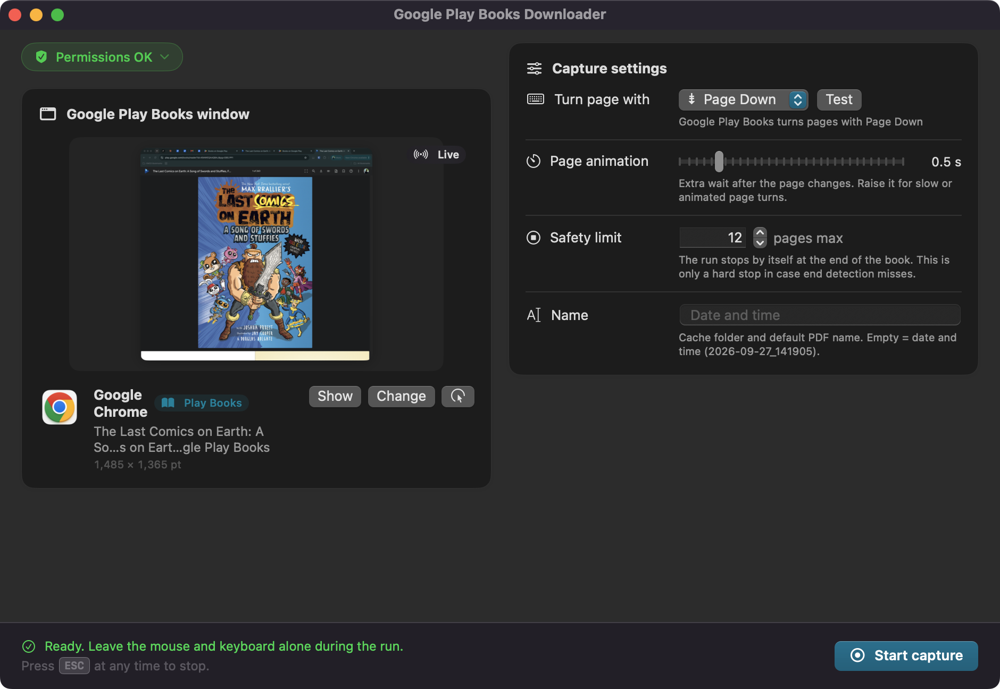
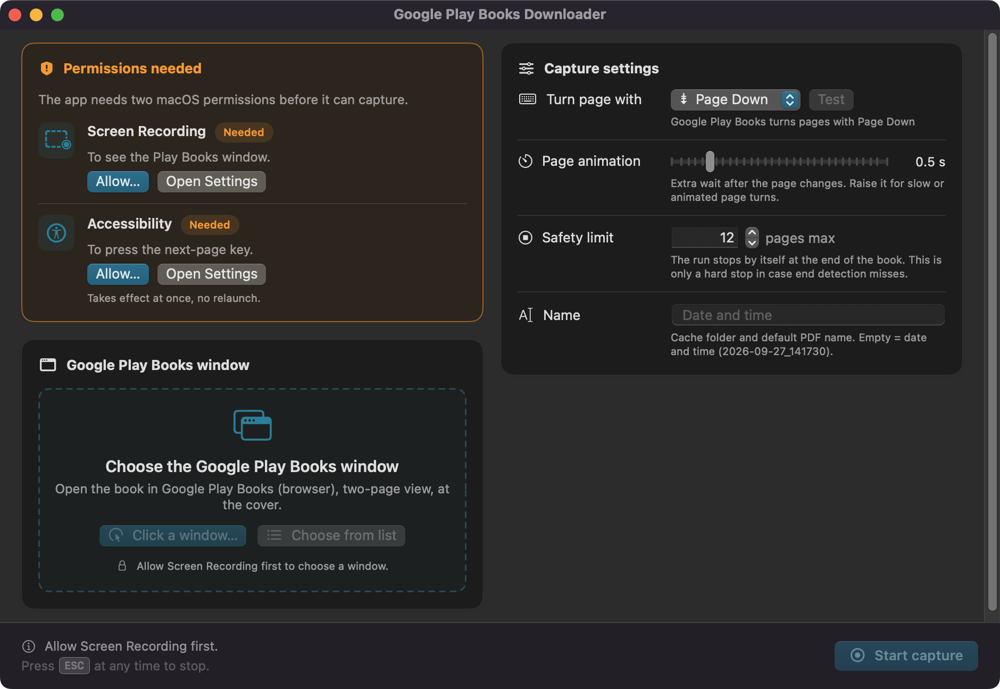
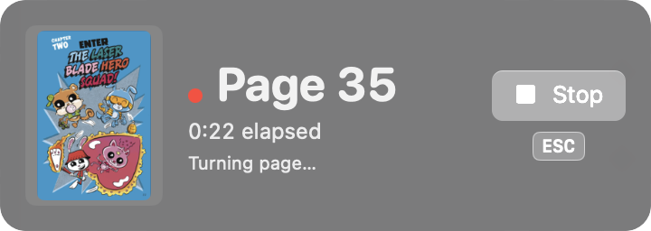
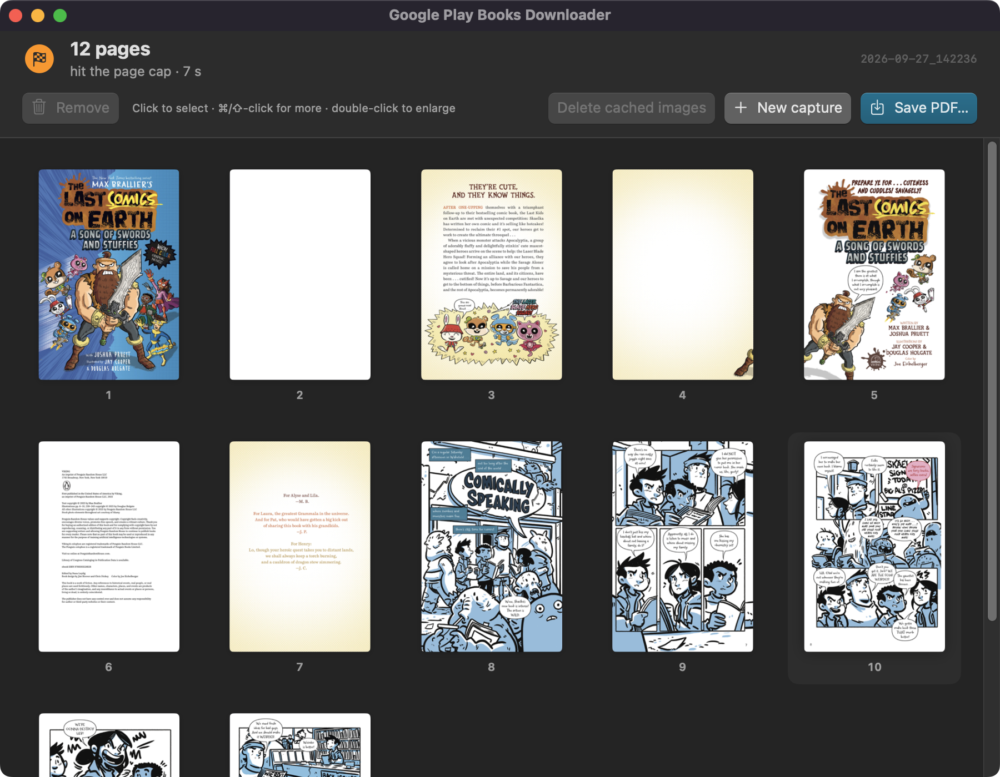
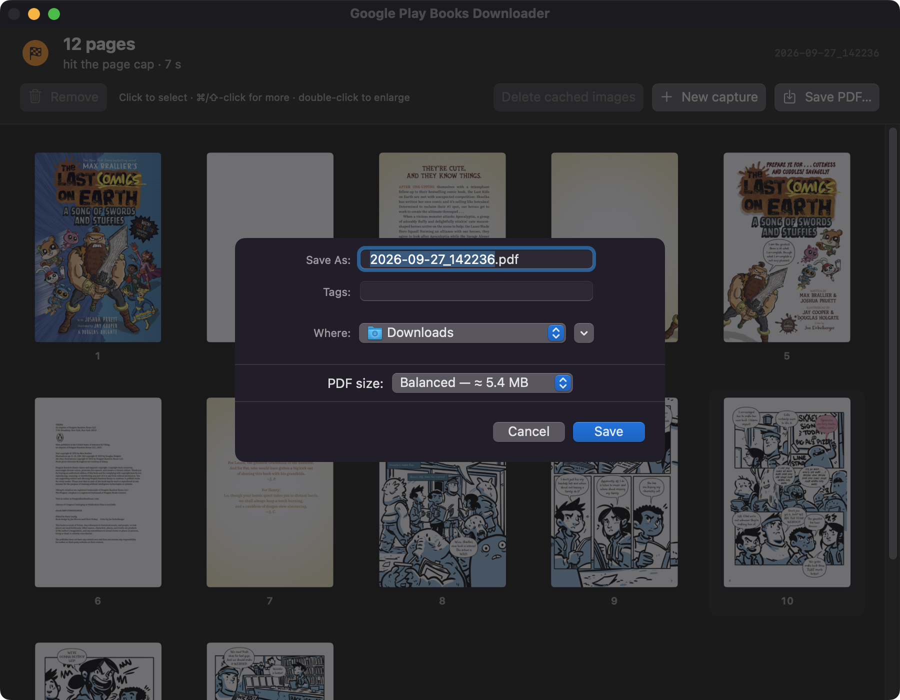

# Google Play Books Downloader

A macOS app that saves a book you can already read in Google Play Books (in your browser) as a PDF.

You open the book in Google Play Books, pick the browser window, and click **Start capture**. The app then turns the pages itself, captures each page, crops it to the paper, splits two-page spreads into single pages, and stops at the end of the book. You check the pages and save one PDF.

The app only records what Google Play Books already shows on your screen. It does not log in, download files, or remove any copy protection. Use it only for books you have the right to copy, and follow the Google Play terms and the copyright law of your country.

## Screenshots

**Setup.** Pick the Google Play Books window. The card shows a live preview of it.



**Permissions.** The first start shows which macOS permissions are missing, with a button for each.



**Capture.** A small panel shows the progress while the app turns the pages.



**Review.** Check the pages, remove the ones you do not want, and save the PDF.



**Save.** Choose the PDF size. The dialog shows the estimated file size.



## Features

- Automatic page crop. The app finds the page by what changes between two page turns, so the browser toolbar and the dark reader background are left out.
- Two-page spreads are split at the gutter. The front cover and the back cover stay whole.
- Automatic end detection. The run stops when the page stops changing, when the book starts again from the beginning, or at a safety limit (500 pages by default). The small "next in the series" screen after the last page is removed.
- Slow-loading pages are handled. The app waits for a loading placeholder to become the real page.
- Review screen with a thumbnail grid. You can remove bad pages, look at a page in full size, and save the PDF.
- Three PDF sizes: **Full**, **Balanced** (default) and **Small**. A 260-page comic was 216 MB, 112 MB and 62 MB.
- A command-line mode for scripted runs.

## Requirements

- macOS 14 (Sonoma) or later.
- Google Play Books open in a browser. The app was tested with Google Chrome.
- Two macOS permissions: **Screen Recording** and **Accessibility** (see below).

## Install

### From the disk image

1. Download `google-play-books-downloader-<version>.dmg` from the [Releases](../../releases) page.
2. Open the disk image and drag **google-play-books-downloader** into **Applications**.
3. The app is not notarized by Apple. On the first start, macOS blocks it. To allow it, do one of these:
   - In Finder, right-click the app, choose **Open**, then click **Open** in the dialog.
   - Or open System Settings > Privacy & Security, scroll down, and click **Open Anyway**.
   - Or run: `xattr -dr com.apple.quarantine /Applications/google-play-books-downloader.app`

### From source

Needs Xcode 16 or the Xcode command line tools (Swift 6).

```sh
git clone https://github.com/1905/google-play-books-downloader.git
cd google-play-books-downloader
make install      # builds the app into /Applications and a command in ~/.local/bin
```

| Command | What it does |
|---|---|
| `make run` | Build and start the app from the repository, without installing. |
| `make test` | Run the unit tests. |
| `make dmg` | Build the release disk image into `.build/`. |
| `make uninstall` | Move the installed app and command to `/tmp/trash`. |

## Permissions

The app needs two permissions. The first window shows their status and has buttons for each.

- **Screen Recording** lets the app see the Google Play Books window. macOS applies it only after a restart of the app: click **Relaunch app**.
- **Accessibility** lets the app press the page-turn key in the browser. It applies at once.

If you start the command-line tool from a terminal, macOS asks for the permissions on behalf of the terminal app instead.

On macOS 15 and later, macOS can also ask once whether the app may "bypass the system private window picker". Click **Allow**.

## How to use it

1. In your browser, open the book in Google Play Books. Use the **two-page view** and go to the **cover**.
2. Start **google-play-books-downloader**.
3. Grant both permissions if the app asks for them.
4. Under **Google Play Books window**, click **Choose from list** and select the browser window. Play Books windows are at the top of the list. The card shows a live preview of the window.
5. Click **Test**. The book must turn one page. Then go back to the cover.
6. Click **Start capture**. Do not use the mouse or the keyboard until the run ends. A small panel shows the page count. Press **ESC** or click **Stop** to stop early.
7. In the review screen, select the pages you do not want and press ⌫. Double-click a page to see it in full size.
8. Press ⌘S, choose the PDF size and a file name, and click **Save**.
9. Optional: click **Delete cached images** to remove the captured pages from the cache.

A 260-page book takes about 5 minutes.

Keep the browser window visible and not minimized during the run. The app brings the window to the front before each page turn, so the Mac cannot be used for other work during a run.

## Command line

```sh
google-play-books-downloader --window-title "Google Play Books" --run-name my-book \
  --autostart --save-pdf ~/Downloads/my-book.pdf
```

| Flag | Value | Meaning |
|---|---|---|
| `--window-title` | text | Use the first window whose title contains this text (case-insensitive). |
| `--run-name` | name | Name of the cache folder. The default is the date and time. |
| `--autostart` | | Start the capture without the setup screen. Needs `--window-title`. |
| `--max-pages` | number | Safety limit. The default is 500. |
| `--key` | `pageDown`, `right`, `down`, `space`, `returnKey` | Page-turn key. The default is `pageDown`, which Google Play Books uses. |
| `--latency` | 0 to 10 | Extra wait in seconds after each page turn. The default is 0.5. |
| `--save-pdf` | path | Write the PDF to this path and quit. Without it, the review screen opens. |
| `--pdf-size` | `full`, `balanced`, `small` | PDF size. The default is `balanced`. |
| `--help` | | Show the usage text. |

Exit codes: `0` success, `1` setup error, `2` bad arguments, `3` missing permission, `4` PDF export failed, `5` window not found, `6` capture failed (a partial PDF is written if there are pages).

## PDF sizes

| Size | Pages | Quality | 260-page comic |
|---|---|---|---|
| Full | as captured (about 1460 × 2190 px) | JPEG 85 % | 216 MB |
| Balanced | at most 1600 px tall | JPEG 75 % | 112 MB |
| Small | at most 1200 px tall | JPEG 65 % | 62 MB |

All three sizes have the same page size in points. Only the resolution is different.

## Files

- Captured pages: `~/Library/Caches/google-play-books-downloader/<run name>/0001.jpg`, `0002.jpg`, and so on.
- Log: `~/Library/Logs/google-play-books-downloader/google-play-books-downloader.log`. Each run writes one `start:` line with the settings it used.

## Limits

- Only Google Play Books in a browser, in two-page view, is supported and tested.
- The page crop expects light pages on a dark reader background. The Google Play Books night theme is not supported.
- A landscape single page, such as a fold-out map, is split like a spread.
- If a page stays blank or shows a loading icon for more than 6 seconds, it is kept as captured. Remove it in the review screen.
- If Google Play Books needs more than 10 seconds to show the next page, the app presses the key again and can skip a page. The log shows this.
- A page that repeats an earlier page exactly (other than blank pages) is taken as the start of the book again, and the run stops there.

## How it works

1. The app compares the window before and after the first page turn. The area that changed is the page area.
2. For each capture, the app finds the rows and columns of paper inside that area and cuts off the dark background, the toolbar, and the part of the next spread that shows below the current one.
3. Each spread is cut at the gutter line between the two pages. The first capture and the last capture stay whole.
4. Each capture is compared with the earlier ones by a perceptual hash, to find the end of the book.
5. The PDF uses the captured JPEG images directly (Full), or scaled-down copies (Balanced, Small).

## Build details

- Swift package with two targets: `ScreenshoterCore` (page detection, capture logic, PDF export; unit-tested) and `google-play-books-downloader` (the macOS app: ScreenCaptureKit capture, key events, SwiftUI interface).
- `make app` signs the app ad hoc with a designated requirement on its bundle identifier (`cc.1905.google-play-books-downloader`). This keeps the macOS permissions after a rebuild.
- `tools/make_icon.swift` draws the app icon.

## License

MIT. See [LICENSE](LICENSE).
